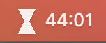
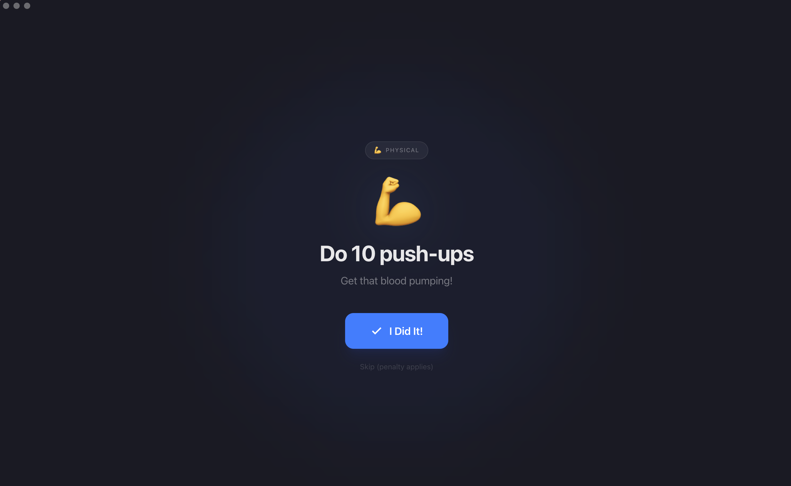
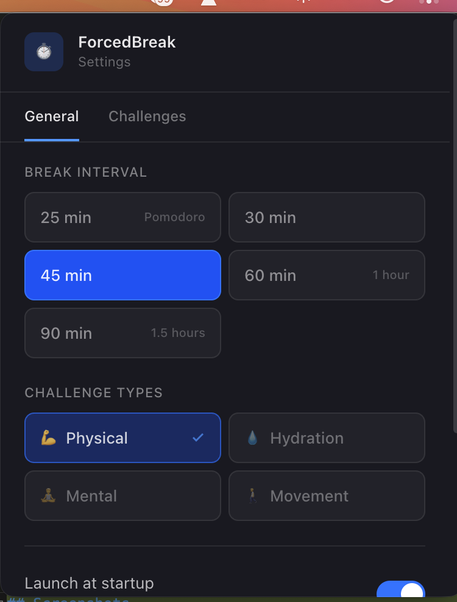
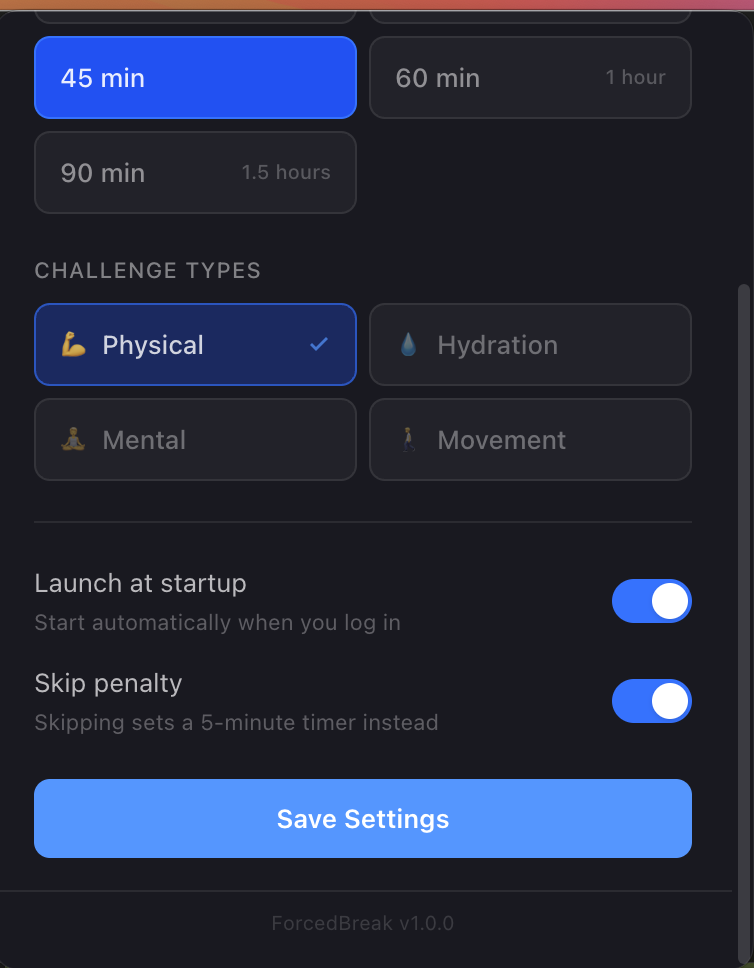
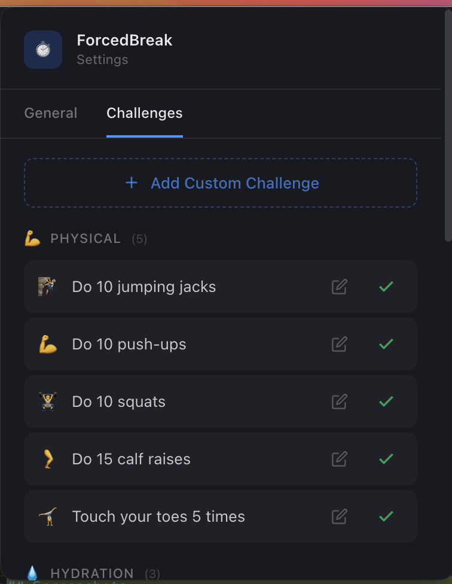
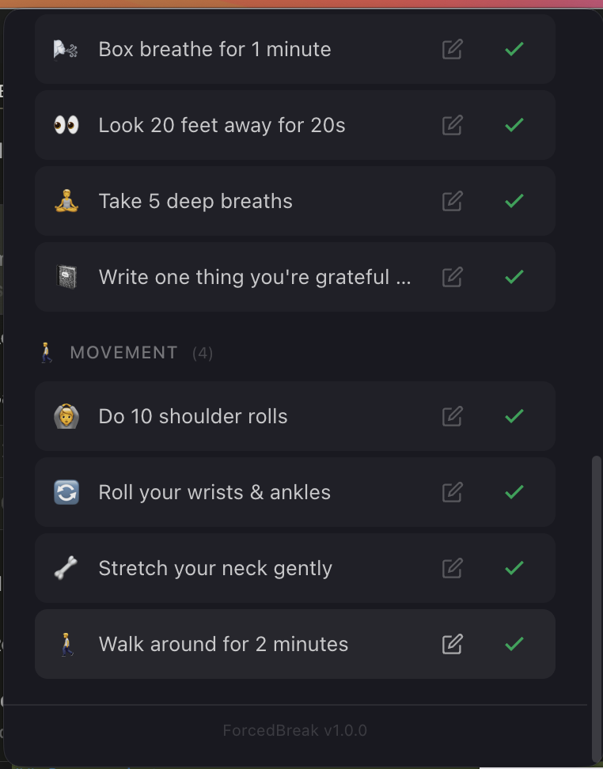
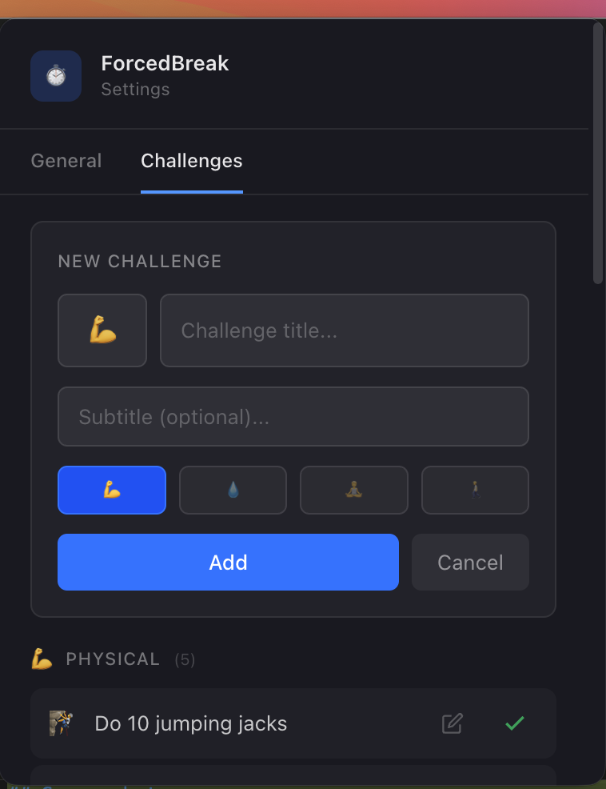

# ForcedBreak

A macOS menu bar app that **forces you to take healthy breaks**. After a configurable interval, a full-screen overlay appears with a physical challenge that can't be dismissed until completed.

No more ignoring break reminders. This one takes over your screen.

  

## Screenshots

### Menu Bar Countdown


### Break Overlay


### Settings
| General | General (cont.) |
|---|---|
|  |  |

### Challenge Manager
| Challenge List | More Challenges | Add Custom Challenge |
|---|---|---|
|  |  |  |

## How It Works

1. A countdown timer runs in your menu bar (ticks every second)
2. When the timer hits zero, a full-screen overlay appears on ALL your monitors
3. You see a random challenge like "Do 10 push-ups" or "Drink a glass of water"
4. You can't dismiss it until you click "I Did It!" or explicitly skip (with a penalty)
5. Timer resets and the cycle repeats

## Features

- **Real-time countdown** in the menu bar (updates every second, not just every minute)
- **16 built-in challenges** across 4 categories: Physical, Hydration, Mental, Movement
- **Custom challenges** - add your own with emoji, title, subtitle, and category
- **Multi-monitor support** - overlay covers all connected displays
- **Streak tracking** - current streak, longest streak, total completed
- **Skip penalty** - skipping restarts the timer at 5 minutes instead of your full interval
- **Configurable intervals** - 25, 30, 45, 60, or 90 minutes
- **Auto-launch at login** - starts automatically when you log in
- **Fully offline** - no accounts, no backend, no data leaves your machine

## Download

Download the latest `.dmg` from [GitHub Releases](https://github.com/hzeeshan/forcedbreak/releases).

### Installation

1. Download `ForcedBreak-1.0.0-arm64.dmg` (Apple Silicon Macs)
2. Open the `.dmg` and drag ForcedBreak to your Applications folder
3. If macOS shows "ForcedBreak is damaged", run this in Terminal:
   ```bash
   sudo xattr -cr /Applications/ForcedBreak.app
   ```
4. Open ForcedBreak from Applications

## Tech Stack

| Layer             | Technology                                        |
| ----------------- | ------------------------------------------------- |
| Desktop framework | [NativePHP](https://nativephp.com) 1.3 (Electron) |
| Backend           | Laravel 12                                        |
| UI components     | Livewire 4                                        |
| Styling           | Tailwind CSS v4                                   |
| Database          | SQLite (local, no server)                         |

### Why Laravel 12, not 13?

NativePHP 1.x requires `illuminate/contracts ^10.0|^11.0|^12.0`. Laravel 13 internalized `illuminate/contracts` (it's no longer a standalone Composer package), which causes a Composer dependency conflict. This project must stay on Laravel 12 until NativePHP officially supports Laravel 13.

## Development Setup

### Prerequisites

- PHP 8.2+
- Composer
- Node.js 18+
- macOS (NativePHP Electron requires it for development)

### Setup

```bash
# Clone the repo
git clone https://github.com/hzeeshan/forcedbreak.git
cd forcedbreak

# Install dependencies
composer install
npm install

# Copy environment file
cp .env.example .env
php artisan key:generate

# Run the app
php artisan native:serve
```

### Building for Distribution

```bash
# Build production .dmg
php artisan native:build mac
```

The `.dmg` output will be in the `dist/` folder.

## Architecture

The app uses a two-layer timer approach:

- **Background ticker** (persistent child process) - Runs every second, decrements the countdown, updates the menu bar label, and triggers the overlay at zero. Works even when the popover is closed.
- **Livewire polling** (UI sync) - When the popover is open, it reads from the cache to display the countdown. Purely a reader, never writes.

This is necessary because Livewire's `wire:poll` only works when a browser window is open, and the menu bar popover is closed 99% of the time.

## Project Structure

```
app/
  Console/Commands/
    CheckBreakTimer.php       # Scheduler safety net (runs every minute)
    TickMenuBarLabel.php      # Per-second countdown + overlay trigger
  Livewire/
    MenuBarTimer.php          # Popover UI component
    BreakOverlay.php          # Full-screen overlay logic
    SettingsPanel.php         # Settings with challenge editor
  Models/
    BreakSetting.php          # Singleton settings
    Challenge.php             # Challenge model (16 built-in + custom)
    Streak.php                # Streak tracking
  Providers/
    NativeAppServiceProvider.php  # NativePHP boot config
```

## Contributing

Contributions are welcome! Feel free to open issues or submit pull requests.

## License

This project is open source and available under the [MIT License](LICENSE).

## Author

Built by [Hafiz Riaz](https://hafiz.dev) - Laravel developer and technical writer.
